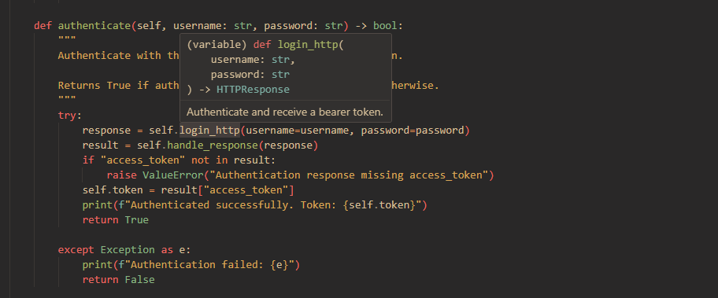

# Overview

A client-side library that wraps server-side functions to enable RPC-style HTTP calls while allowing you to maintain control over HTTP requests.

## Why?

Working across HTTP boundaries with a HTTP client and server introduces friction:

1. **Type information from the backend is lost** — No type inference or validation for payloads and parameters sent in your HTTP requests
2. **Forced to rely on out-of-band documentation** — All the information about the backend schema lives in OpenAPI/Swagger docs, where it's not visible in your editor.


But, with this package, your client side code can now have descriptive type information and docstrings right in the editor!




**How it works:**

- Import server functions decorated with FastAPI/Flask on the client side
- Wrap them with `wrap_backend_call()`
- Call them as regular functions; the library translates calls into HTTP requests
- Handle the HTTP responses as per usual

A simple default HTTP implementation is included, but you can substitute your own with retry logic, caching, error handling, logging, etc.

Here is an example:

```python
from server import get_item 
from http_clientlib import set_default_configuration, wrap_backend_call
from http_clientlib.http import make_http_request

set_default_configuration(
   base_url="http://production.backend.com", http_request_function=make_http_request
)

# Wrap the backend function and invoke it to make a HTTP request
get_item_http = wrap_backend_call(get_item)
response = get_item_http(item_id=42, page=2)
print(response) # HTTPResponse
```

An example with a POST endpoint and request body

```python
# POST request with Pydantic model for the request body 
create_item_http = wrap_backend_call(post_endpoint)
response = create_item_http(data=ItemData(id=1, name="A Box"))

# POST request using a dictionary directly
response = create_item_http(data={"id": 1, "name": "Sample Item"})
print(response)
```

```python 
@app.get("/items/{item_id}")
def get_item(item_id: int, page: int = 0) -> Annotated[dict, "GET /items/{item_id}"]:
   """A GET endpoint with both path and query parameters."""
   return {"item_id": item_id}


class ItemData(BaseModel):
   id: int
   name: str

@app.post("/items")
def post_endpoint(data: ItemData) -> Annotated[dict, "POST /items"]:
   """A POST endpoint that accepts a Pydantic model as the request body."""
   return {"message": f"Item {data} created"}

```


## Benefits

1. **Type safety in the editor** — Full type information available for IDE autocomplete and validation
2. **Endpoint schema visibility** — Query params, path params, request body, headers, cookies are all immediately apparent in your code
3. **Docstring availability** — Server function docstrings show up in the client IDE
4. **Code Generation not required** — Additional tooling or auto-generated code
   Changes to server signatures are immediately caught on the client side.

## Limitations

1. **Python-only** — Works for a frontend/backend stack built in python
2. **Server code must be imported** — Client needs access to server function definitions


